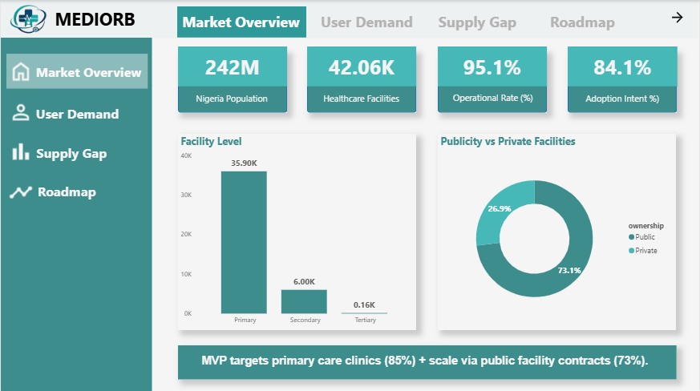
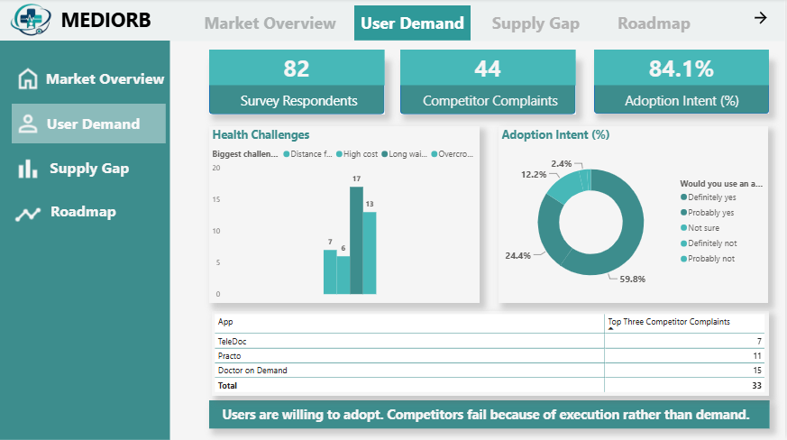
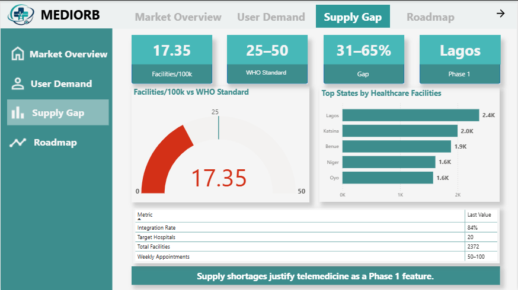
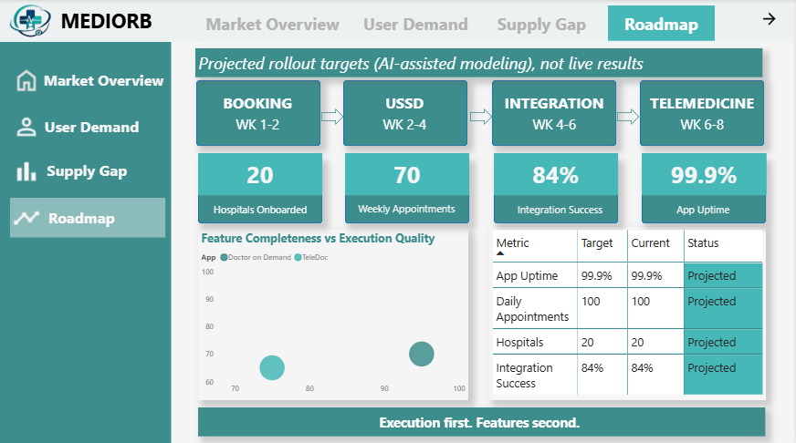

# MediOrb — Healthcare Appointment Booking: Market Validation & Dashboard Strategy

_Data analysis for a healthcare appointment-booking platform, built as part of Team Nova at the TechCrush Alumni Buildathon._

## Business Problem

Nigeria's healthcare system serves an estimated 242.4M people (UN Population Division, 2026) through 42,063 registered facilities, but only 8.5% of those facilities have any form of digital booking system. MediOrb set out to validate whether there was real demand for a digital appointment-booking platform, and whether the supply side (the facilities themselves) could realistically support it. Before writing a line of product code, the team needed to answer: **is this a real market, or a solution looking for a problem?**

## My Role

As data analyst on Team Nova, I analyzed the demand-side survey data (collected by the design team), led the supply-side facility research and competitor failure analysis, and drove the Power BI dashboard strategy behind this validation report, translating raw survey results, Play Store review data, and facility-level statistics into a decision-ready case for the product and engineering team.

## Approach

- **Demand-side:** Analyzed an anonymous survey (n=82, collected by the design team) covering demographics, digital readiness, healthcare access barriers, and adoption intent
- **Competitive analysis:** Sourced and reviewed 44 documented user complaints from Google Play Store reviews of existing healthcare apps, to identify _why_ competitors were failing, not just that they were
- **Supply-side:** Analyzed facility-level data across 42,063 registered healthcare facilities density, ownership (public/private), digital booking penetration, and geographic distribution
- **Synthesis:** Combined both sides into a phased go-to-market strategy (pilot → public network expansion → rural USSD strategy), with the rollout sequencing informed in part by AI-generated projections

## Key Findings

**Demand is real and quantified, not assumed.**
84.2% of surveyed users showed adoption intent for digital appointment booking (59.8% "definitely yes," 24.4% "probably yes"). The two biggest pain points, long wait times (54.3%) and appointment difficulty (23.5%) map directly onto MediOrb's core value proposition.

**Competitors aren't failing on demand, they're failing on execution.**
Of 44 documented complaints, 52% cited technical instability (crashes, broken logins) and 32% cited hospital integration gaps (bookings not reaching the hospital, no confirmation). These are solvable engineering problems, not market-fit problems, which reframes MediOrb's opportunity from "convince people to use this" to "just don't break what competitors broke."

**The supply side has real headroom.**
Nigeria has 17.35 facilities per 100k people against a WHO standard of 25–50 and a 31–65% unmet demand gap. 85.4% of facilities are primary-care clinics (the volume market MediOrb should target first, not teaching hospitals), and 91.5% of all facilities have no digital booking system at all.

## Strategic Recommendation

_Note: the phased rollout sequencing below draws on AI-generated projections used to fill data gaps under the buildathon timeline, see Data Sources._

Phase the rollout by facility density and digital-readiness, not by trying to launch everywhere at once:

1. **Phase 1 — Lagos pilot:** 2,372 facilities, majority private, smartphone-ready users. Prove the app + private hospital workflow.
2. **Phase 2 — Public network expansion:** Kano, Katsina, Kaduna. Prove the government-partnership model.
3. **Phase 3 — Rural USSD strategy:** Underserved states, USSD-first rather than app-first, with telemedicine as the core offering to close the unmet demand gap.

MVP scope should prioritize stability and reliability (zero-tolerance for crashes, given competitor failure #1) over feature breadth, the research shows users will forgive a simple app that works over a feature-rich one that doesn't.

## Dashboard

Power BI dashboard built to let the product/engineering team explore facility density by state, competitor failure categories, and demand signals interactively, rather than reading them as static numbers in a report.

[Download the interactive dashboard (.pbix)](https://github.com/Dasha69-ops/mediorb-healthcare-dashboard/releases/download/v1_0_/MEDIORB.ANALYSIS.pbix) — requires Power BI Desktop to open.

| Market Overview                                        | User Demand                                    |
| ------------------------------------------------------ | ---------------------------------------------- |
|  |  |

| Supply Gap                                   | Roadmap                                |
| -------------------------------------------- | -------------------------------------- |
|  |  |

## Tools Used

- **Excel** — data cleaning and preparation
- **Power BI** — dashboard build and strategy
- Survey design and analysis

## Data Sources

- **Facility-level data:** Nigeria hospitals and clinics dataset (HXL-tagged, humanitarian open data), 42,063 facilities. _Note: other public sources cite figures in the 44,000–44,700 range for Nigeria's total registered facilities, a ~6% variance likely reflecting differences in registry snapshot date, inclusion criteria (e.g. standalone labs, informal private clinics), or update cadence across Nigeria's fragmented health facility registries. This analysis uses one dataset consistently throughout rather than blending sources, to keep all downstream per-capita and density figures internally comparable._
- **Population data:** UN Population Division 2026 estimate (242.4M national total); state-level 2026 populations estimated by scaling each state's 2016 census-based projection proportionally to match the verified national total, preserving each state's relative population share
- **Survey data:** primary research, n=82, fully anonymous, collected by the design team and analyzed by me
- **Competitor complaint data:** sourced from Google Play Store reviews of existing healthcare apps (44 documented complaints total; top 3 competitors by volume shown in the dashboard table)
- **AI-generated data:** the Section 4 / Roadmap page strategic rollout (timelines, hospital-onboarding targets, and volume projections) draws on AI-assisted modeling used to fill data gaps under the buildathon's timeline, these are projections to guide planning, not measured or achieved results

## Acknowledgments

Built as part of Team Nova at the TechCrush Alumni Buildathon. This repository reflects my individual contribution (market research, competitive analysis, dashboard strategy) within a team project.
